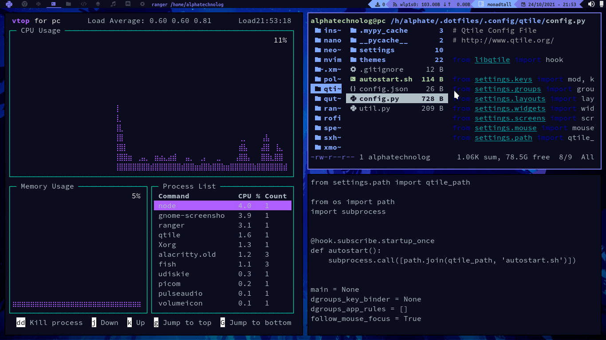

# dotfiles

This is my dotfiles, now only have xmonad, xmobar and qtile configs, but in
the future I will add configs for dwm, i3wm, bspwm, sxhkd, polybar
spectrwm, tint2, dwmblocks and much more.

## Screenshots


<br>

<br>

<br>


## Config explain

To use my neovim configuration you must install [vim-plug](https://github.com/junegunn/vim-plug)
and then use the command `:PlugInstall`, and then, restart the editor.

## Notes

This config is oriented to a Debian users and the install.sh script is only
tested on Debian, if you have another system, and you are experimenting a
dotfiles problems, please specify your system and your question in a new issue
and I try to make compatibility to your system in the install.sh script (if is possible)

My OS are Debian (remember this!)

## Installing with install.sh

To install my dotfiles you can copy and paste some configs directories, but I
create a script that makes this automatically, it not copy and paste files and
directories, it makes symlinks on your system to the dotfiles files (remember this before custom your configs!)

To use the `install.sh` script, get it!:

```sh
curl -sL https://raw.githubusercontent.com/AlphaTechnolog/dotfiles/main/install.sh -o dotfiles-install.sh
chmod +x ./dotfiles-install.sh
```

And then exec it!

```sh
./dotfiles-install.sh
```

It show a menu like this:

```
##########################################
#### Welcome to my dotfiles installer ####
##########################################
----------------------------------------
Steps:
  1. Clone the dotfiles (not required if already have)
  2. Install the required programs
  3. Create .config symlinks
  4. Create /home/alphatechnolog symlinks
  5. Create .local/bin symlinks (optional because the step 1 already apply this)
  6. Setup rofi
  7. Exit of installer

Uninstall:
  8. Remove all config
----------------------------------------
=> Write the option to make:
```

The steps are listed in it script!

At finished the configuration change in the login screen your session to xmonad or qtile!

## GTK

This config replace the gtk files to my gtk files, you must install the gtk
requirements listed here:

- cz-Hickson-White (The cursor)
- Papirus Icon Theme (The icon theme, select the teal style in your console: $ papirus-folders -C teal)
- dt-dark-theme (It is encountered in the distrotube repository!)

## Cheatsheet

Conky already have this, but in this guide I present it for you!

- S-RET : alacritty
- S-b : brave-browser
- S-SPC-RET : rofi
- S-w : close active window
- S-hjkl : move between windows
- S-Shift-hjkl : move window focus
- S-[0-9] : Change between workspaces
- S-h/l : Resize focused window
- S-e-e : Spawn emacs
- S-e-v : Spawn neovim
- S-Shift-r : Restart xmonad
- S-Shift-q : Quit xmonad and go to login screen

## Tips

My favorite shell is fish, to change the shell in bash to fish, use the command
`tofish`, it is an alias to change the default shell to fish, if the password
is asked, please write your user password.

## What's the next

Install firefox in the route `.config/installed-apps/firefox`, this because qtile and xmonad and all config call as default browser the order `$ ~/.config/installed-apps/firefox/firefox`
